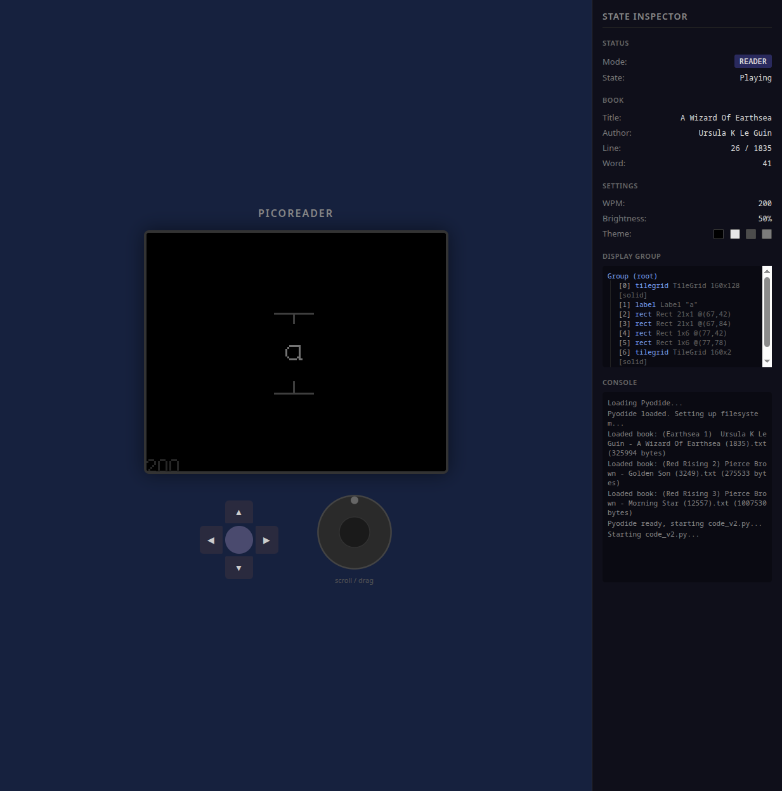
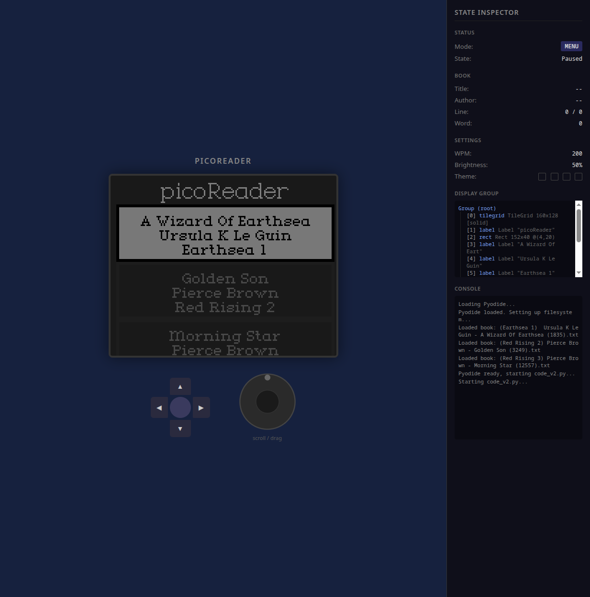

# picoReader

An RSVP (Rapid Serial Visual Presentation) speed-reading eReader built on a Raspberry Pi Pico. Displays one word at a time from plain text books stored on an SD card.



## Hardware

- Raspberry Pi Pico (CircuitPython 8.0.5)
- 160x128 ST7735R SPI LCD
- Rotary encoder clickwheel (Adafruit #6310)
- 5-button keypad
- SD card (SPI)

### Pin Mapping

| Function | Pins |
|----------|------|
| SPI (shared) | GP2 CLK, GP3 MOSI, GP4 MISO |
| Display | GP17 DC, GP18 RST, GP19 CS |
| SD Card | GP15 CS |
| Encoder | GP14 A, GP13 B |
| Backlight PWM | GP16 |
| Buttons | GP11 CENTER, GP9 UP, GP10 LEFT, GP8 RIGHT, GP6 DOWN |

## Controls

| Mode | CENTER | UP | LEFT / RIGHT | Encoder |
|------|--------|----|--------------|---------|
| **Reader** | Play / Pause | Menu (when paused) | Display settings (when paused) | Playing: adjust WPM. Paused: step word-by-word |
| **Menu** | Select book | -- | -- | Scroll through books |
| **Display** | Return to reader | Menu | Cycle themes | Adjust backlight |

## Project Structure

```
firmware/       CircuitPython code deployed to the Pico
  boot.py       Remounts filesystem writable for save support
  code.py       Main application (single-file)
simulator/      Browser-based simulator (Pyodide + Vite)
screenshots/    Screenshots of the simulator
docs/           Design specs
fonts/          (not tracked) PCF bitmap fonts
lib/            (not tracked) Adafruit CircuitPython libraries
```

## Setup

### Fonts

The firmware requires two PCF bitmap fonts in a `fonts/` directory on the Pico:

| Font | Used for | License |
|------|----------|---------|
| `Toronto_14.pcf` | Reading text | Apple copyright (not redistributable) |
| `Toronto_9.pcf` | UI elements | Apple copyright (not redistributable) |

Toronto is a classic Macintosh bitmap font by Susan Kare. You can convert it from original Mac resources or substitute any PCF font. Additional open-licensed fonts that work well at 14px on this display:

- **Bitter** (SIL OFL) - [Google Fonts](https://fonts.google.com/specimen/Bitter)
- **Merriweather** (SIL OFL) - [Google Fonts](https://fonts.google.com/specimen/Merriweather)
- **IBM Plex Serif** (SIL OFL) - [Google Fonts](https://fonts.google.com/specimen/IBM+Plex+Serif)
- **Crete Round** (SIL OFL) - [Google Fonts](https://fonts.google.com/specimen/Crete+Round)
- **Aleo** (SIL OFL) - [Google Fonts](https://fonts.google.com/specimen/Aleo)
- **Bree Serif** (SIL OFL) - [Google Fonts](https://fonts.google.com/specimen/Bree+Serif)
- **Special Elite** (Apache 2.0) - [Google Fonts](https://fonts.google.com/specimen/Special+Elite)

To convert a TTF/OTF to PCF for CircuitPython, use [FontForge](https://fontforge.org/) or Adafruit's [font tools](https://learn.adafruit.com/custom-fonts-for-pyportal-circuitpython-display).

### CircuitPython Libraries

Install the following Adafruit libraries to `lib/` on the Pico via [circup](https://github.com/adafruit/circup) or the [CircuitPython bundle](https://circuitpython.org/libraries):

- `adafruit_bitmap_font`
- `adafruit_display_text`
- `adafruit_display_shapes`
- `adafruit_st7735r`
- `adafruit_itertools`
- `adafruit_ticks`
- `asyncio`

### Books

Place plain `.txt` files in `/sd/books/` on the SD card. Filenames encode metadata:

```
(Series) Author - Title (wordcount).txt
```

For example: `(Earthsea 1) Ursula K Le Guin - A Wizard Of Earthsea (1835).txt`

### Deploying to Pico

Copy the contents of `firmware/` to the root of the Pico's USB drive, along with the `fonts/` and `lib/` directories. The device auto-reloads on file change.

```
PICO/
  boot.py
  code.py
  fonts/
  lib/
```

## Browser Simulator

A browser-based simulator runs the same `code.py` via [Pyodide](https://pyodide.org/) with Python shims replacing the hardware modules.

```bash
cd simulator
npm install
npm run dev
```



## License

Source code in this repository is provided as-is. Fonts are not included; see [Fonts](#fonts) for sourcing.
